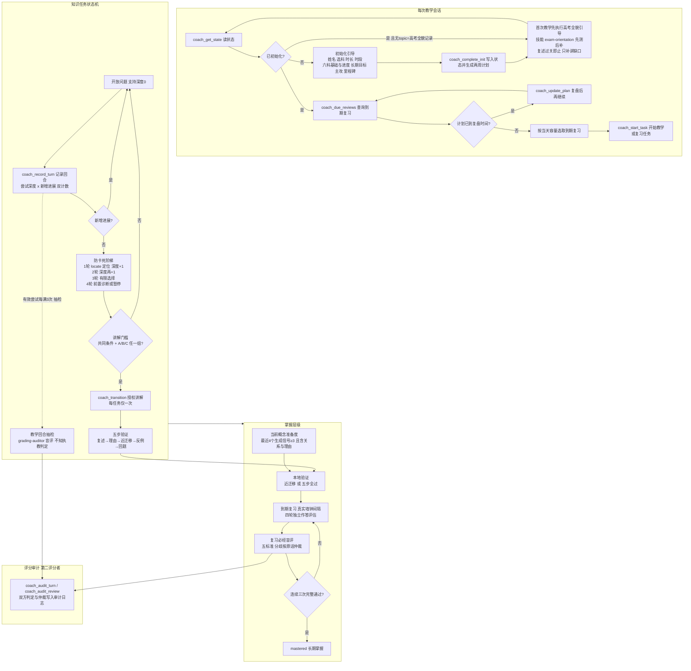

# 系统架构总览（唯一参考事实）

本文件包含两张图：**教学法架构图**与**系统架构图**。它们是本项目设计的唯一参考事实。

开发规则：

1. 任何项目更改必须先反映到对应图中，再修改文件。禁止先改实现后补图。
2. 图与实现不一致时，以图为准。发现不一致时，先修正图，再继续开发。
3. 每次改动完成后，核对两张图仍然准确。

## 图一：教学法架构

这张图描述教学法本身：会话流程、防卡死阶梯、讲解门槛、五步验证与掌握层级。它不描述文件和技术实现。

## 已知软约束（提示词层，无工具校验）

以下规则只由提示词约束，`extensions/` 不做强制。出现偏差时不必改工具，按 SKILL.md 规则纠正执教行为：

1. SKILL.md 第 11 节第 6 条：候选前置节点不是当前任务的目标关系。节点与关系是语义比对，字符串级无法可靠校验。
2. `feeling` 只能来自学员主动报告，不得推断。`coach_log_session` 只在工具描述中声明该规则，无法验证来源。
3. 不得连续追问"为什么"超过两次。工具不做追问计数。

## 图二：系统架构

这张图描述文件、进程与数据流。它不描述教学法。分发包源文件路径相对本仓库。部署后的 `.pi/` 路径相对学员工作目录。消费端经 `.pi/git/` 加载分发包，或经 `scripts/setup.sh` 复制规则与种子。

本图只保留独立 Web 插件的外部入口。Web 内部架构由 [`gaokao-coach-web/docs/architecture.md`](../../gaokao-coach-web/docs/architecture.md) 独立维护，不在本包展开。教学规则与状态仍由本包管理。

Web 已实现单学员教学会话入口、工作区文件浏览和单文件下载。标注“规划”的虚线表示尚未实现的接入边界。

```mermaid
flowchart TB
    subgraph MAC[Mac 提醒链路]
        L[launchd 到点提醒<br>时间读 profile.reminder.time] --> RSH[.pi/macos/remind.sh<br>读状态算到期复习与计划复盘]
        RSH --> N[.pi/macos/notifier/CoachNotifier.app<br>通知横幅 含开始学习按钮]
        N -->|点击横幅| T[Ghostty 优先 否则 Terminal 唤起 pi]
    end

    subgraph PKG[分发包 gaokao-coach-package<br>GitHub 公开仓库]
        PKG_SRC[extensions/ skills/ prompts/<br>macos/ templates/ scripts/ test/<br>docs/architecture.md AGENTS.md<br>开发规则与图 不进学员会话]
        PKG_DEP[package.json dependencies<br>&#64;mjakl/pi-subagent 子代理运行时]
    end

    subgraph INSTALL[安装与更新]
        SETUP[scripts/setup.sh<br>首次复制种子 不覆盖演化数据<br>规则件随包覆盖部署]
        MIGRATE[scripts/migrate-catalog.mjs<br>目录追加迁移 幂等 冲突失败 自动备份]
        CLONE[.pi/git/github.com/Soulshop/<br>gaokao-coach-package 自动 clone<br>clone 后自动 npm install]
        NMOD[node_modules/&#64;mjakl/pi-subagent<br>随包注入的子代理扩展]
    end

    subgraph PI[教学系统 .pi 常驻于系统提示与技能]
        T --> PROMPT[prompts/coach.md 开场流程]
        T --> SKILL[skills/coach/SKILL.md 教学规则<br>skills/exam-orientation/SKILL.md<br>skills/reminder/SKILL.md 提醒控制]
        T --> APP[templates/APPEND_SYSTEM.md<br>经 setup 部署到 .pi/APPEND_SYSTEM.md<br>常驻教学角色 教学会话流程]
        PROMPT -->|展开流程| SKILL
        SKILL -->|调用 12 个 coach 工具| EXT[extensions/coach/index.ts<br>工具注册入口]
        EXT --> CAT[catalog.ts 规范目录校验<br>读工作目录实例]
        EXT --> TEACH[teaching.ts 回合状态机与门槛]
        EXT --> PLAN[plan.ts 两周计划与复盘]
        EXT --> SCHED[scheduler.ts SM-2 仅完整复习]
        EXT --> ST[state.ts 状态模型与迁移]
        EXT --> AUDITMOD[audit.ts 评分审计<br>一致性比较与统计]
        NMOD -->|注册| SUB[subagent 子代理工具]
        SUB -->|启动时发现项目代理| AGENTMD
        SKILL -->|盲评复评 不携带执教判定| SUB
    end

    WEB[gaokao-coach-web<br>外部 Web 交互入口<br>教学会话已实现<br>工作区文件浏览与单文件下载已实现]

    subgraph REM[提醒扩展 独立于教学]
        REMEXT[extensions/reminder/index.ts<br>reminder_get/set/test]
        REMEXT --> REMIND[reminder.ts 渲染 plist + launchctl load/unload]
    end

    subgraph ROOT[学员工作目录]
        PROFILE[(".pi/state/profile.json<br>唯一结构化状态<br>reminder{enabled,time}")]
        AUDITLOG[(.pi/state/grading-audit.jsonl<br>评分审计日志 只追加)]
        AGENTMD[.pi/agents/grading-auditor.md<br>复评员定义 随包覆盖]
        NODE[(学习资料/知识节点.json<br>规范知识与前置边 演化版)]
        LM[学习计划.md 自动生成视图]
        KM[学习资料/广东高考知识地图.md 边界说明]
    end

    PKG_SRC -->|settings.packages 引用 自动 clone| CLONE
    PKG_SRC -->|setup 复制种子| SETUP
    PKG_DEP -->|npm install 安装| NMOD
    CLONE -->|加载扩展/技能/提示| PI
    CLONE -->|加载提醒扩展| REMEXT
    SETUP -->|首次复制 之后只读不回流| ROOT
    MIGRATE -->|仅追加缺失节点 按 aliases 改接旧ID| ROOT
    SETUP -->|规则件随包覆盖| AGENTMD
    EXT <-->|文件写入队列 原子写| PROFILE
    REMEXT <-->|读写 reminder 字段| PROFILE
    AUDITMOD -->|文件写入队列 只追加| AUDITLOG
    EXT -->|读取演化版| NODE
    REMIND -->|reminder_set 写 plist + launchctl load| L
    PROFILE -->|renderStudyPlan 生成| LM
    RSH -->|读取| PROFILE
    WEB -->|通过 pi 接入并复用教学系统| PI
    WEB -->|服务端只读公开学习文件<br>排除隐藏项 链接文件与内部状态| ROOT
```

